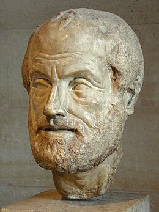
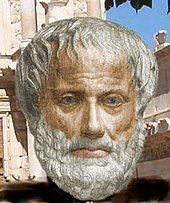

<meta chartes="utf-8" />
<html>
 <head>
 <meta name="viewport" content="width=device-width, initial-scale=1">
 <link rel="stylesheet" href="https://www.w3schools.com/w3css/4/w3.css">
 
 </head>

 <body>
 <h1 id="para1">CULTURE GÉNÉRALE </h1>
    

  
 
<b>ARISTOTE </b>

  

    <button class="w3-bar-item w3-button tablink w3-red" onclick="openCity(event,'1')">Qui est-il</button>
    <button class="w3-bar-item w3-button tablink" onclick="openCity(event,'2')">Biographie</button>
    <button class="w3-bar-item w3-button tablink" onclick="openCity(event,'3')">Oeuvres</button>
    <button class="w3-bar-item w3-button tablink" onclick="openCity(event,'4')">À retenir</button>
  

  
  

    
 Aristote est un philsophe grec. 
 
  
 
     
     
 
 
  

  

   

  

  

    <h2>Tokyo</h2>
    
Tokyo is the capital of Japan.

  

  
  

    <h2>Tokyo</h2>
    
Tokyo is the capital of Japan.

  

 

 
 

 
  
 
 
  </body>
 
